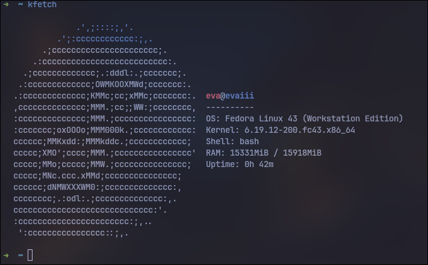
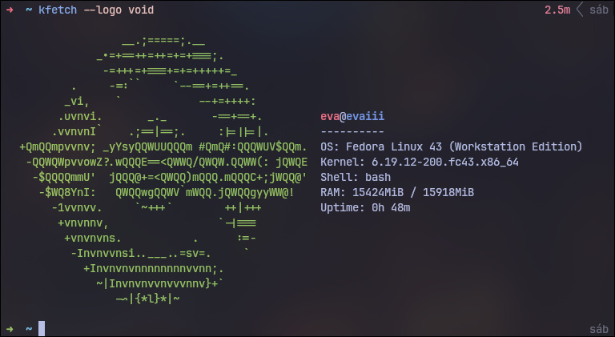

# kfetch

A lightweight system information tool for Linux, written in C. Displays a distribution ASCII logo alongside system details directly in your terminal.


```
                  -`                  eva@machine
                 .o+`                 ----------
                `ooo/                 OS: Arch Linux x86_64
               `+oooo:                Kernel: 6.9.3-arch1-1
              `+oooooo:               Shell: zsh
              -+oooooo+:              RAM: 3141MiB / 15926MiB
            `/:-:++oooo+:             Uptime: 5h 35m
           `/++++/+++++++:
          `/++++++++++++++:
         `/+++ooooooooooooo/`
        ./ooosssso++osssssso+`
       .oossssso-````/ossssss+`
      -osssssso.      :ssssssso.
     :osssssss/        osssso+++.
    /ossssssss/        +ssssooo/-
  `/ossssso+/:-        -:/+osssso+-
 `+sso+:-`                 `.-/+oso:
`++:.                           `-/+/
.`                                 `/
```

## Supported Distributions

Arch, Artix, Alpine, Bedrock, CachyOS, Fedora, Debian, Ubuntu, Gentoo, openSUSE, Void, Windows (WSL), Devuan (sysvinit), Parabola, openSUSE Leap, openSUSE Tumbleweed

## Requirements

- Linux or WSL
- GCC or any C99-compatible compiler
- libpng
- libjpeg

## Building

```sh
git clone https://code.chipmunk.land/homueicon/kfetch.git
cd kfetch
gcc -o kfetch kfetch.c -lpng -ljpeg
```

Install dependencies if needed:

```sh
# Fedora
sudo dnf install libpng-devel libjpeg-devel

# Arch / Artix / CachyOS
sudo pacman -S libpng libjpeg-turbo

# Debian / Ubuntu
sudo apt install libpng-dev libjpeg-dev

# Alpine
sudo apk add libpng-dev libjpeg-turbo-dev

# Gentoo
sudo emerge libpng jpeg

# openSUSE
sudo zypper install libpng16-devel libjpeg8-devel

# Void
sudo xbps-install libpng-devel libjpeg-turbo-devel

# Windows
winget install libpng-devel libjpeg-turbo-devel git (idk how to use winget)
```

## Install

```sh
sudo mv kfetch /usr/local/bin/
or
sudo mv kfetch /usr/bin
```

## Usage

```sh
# Auto-detect distro and run
kfetch

# Force a specific distro logo
kfetch --logo <distro>

# Render a JPG or PNG as ASCII art logo
kfetch --logo ~/path/to/image.png

# Set ASCII image size in columns x rows
kfetch --logo ~/path/to/image.png --size 40x20

# Re-run the interactive setup wizard
kfetch --setup

# Open the config file in $EDITOR
kfetch --config

# Show help
kfetch --help
```

Available logo names:

```
arch  artix  alpine  bedrock  cachyos  fedora  debian  ubuntu  gentoo  opensuse  void  windows 
opensuse-leap opensuse-tumbleweed parabola devuan
```

## First Run

On first launch, kfetch opens an interactive setup wizard to configure your username, hostname, and which fields to display. The wizard runs automatically when no config file is found. To reopen it manually, pass `--setup`.

## Configuration

Settings are saved to `~/.config/kfetch/kfetch.conf` after setup. The file can also be edited directly with `kfetch --config` or any text editor.

```ini
user=alice
host=workstation
show_os=1
show_kernel=1
show_shell=1
show_ram=0
show_uptime=0
```

Set any `show_*` field to `1` to display it or `0` to hide it.

## Images & Screenshots

### Kfetch default



## Kfetch installation


## Kfetch on custom logo (kfetch --logo void)


## Adding a Distribution

1. Add an entry to the `DistroID` enum in `kfetch.c`
2. Define a `static const char *lines_<name>[]` array with the ASCII art
3. Add a row to the `distros[]` table with line count and max width
4. Add a detection string in `detect_distro()`

## License

MIT	

## Support in Commits or pr's.
